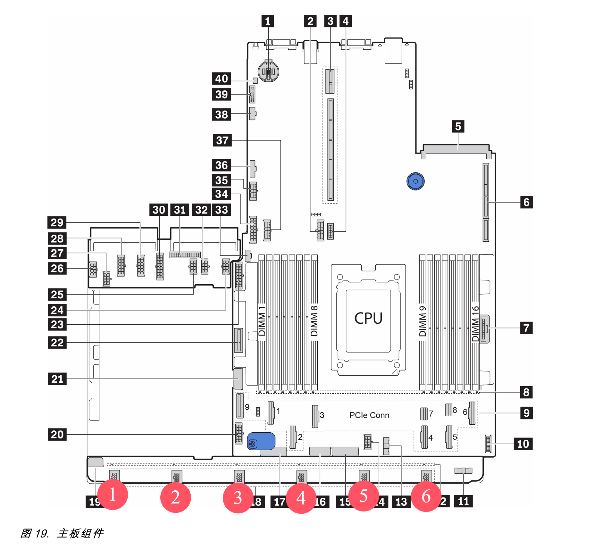

# IPMI Fan Controller for Lenovo SR655 V1

基于传感器温度动态调整服务器风扇转速的Python脚本。**仅适配了联想SR655 V1服务器**，其他设备可能导致不可预知结果。

## ⚠️ 重要警告

- **硬件风险**：此脚本有导致硬件永久损坏的风险

## 功能特性

- 多传感器监控（CPU/GPU/NVMe）
- 可配置温度-转速曲线
- 多风扇独立控制

## 环境要求

- Linux系统（测试于Ubuntu 22.04）
- `ipmitool` 
- `lm-sensors` 
- Python

## 快速部署

1. 安装依赖
```bash
sudo apt install ipmitool lm-sensors
```

2. 克隆仓库
```bash
git clone https://github.com/fyr233/sr655-fan-control.git
```

3. 配置说明
编辑fan_control.py的配置区域：
```python
# 传感器映射（逻辑名称 -> [芯片名, 特征组, 字段名]）
SENSOR_MAPPING = {
    'cpu': ('k10temp-pci-00c3', 'Tctl', 'temp1_input'),
    'gpu0': ('amdgpu-pci-0300', 'junction', 'temp2_input'), # slot 7
    'gpu1': ('amdgpu-pci-8300', 'junction', 'temp2_input'), # slot 4
    'nvme1': ('nvme-pci-4200', 'Composite', 'temp1_input'),
    'nvme2': ('nvme-pci-4100', 'Composite', 'temp1_input')
}

# 风扇控制策略（风扇ID -> 监控的传感器列表）
FAN_CONFIG = {
    1: ['gpu0'],
    2: ['gpu0', 'gpu1'], 
    3: ['gpu1'], 
    4: ['gpu1', 'cpu'], 
    5: ['cpu'], 
    6: ['cpu'] # 风扇6只监控CPU温度
}

# 转速控制分段线性曲线（温度℃, 转速百分比），按温度升序排列
SPEED_CURVE = [
    (40, 5),   # ≤40℃: 5%
    (50, 8),   
    (60, 15),
    (70, 40),
    (80, 50),
    (90, 60),
    (95, 100)   # ≥95℃: 100%
]

# 脚本退出时转速百分比
EXIT_SAFE_SPEED = 50
```
风扇编号参考：


4. 运行监控
- 推荐将ipmitool设为无需密码的sudo命令
```bash
# 允许无密码执行ipmitool
echo "$USER ALL=(ALL) NOPASSWD: /usr/bin/ipmitool" | sudo tee /etc/sudoers.d/ipmi
```
- 启动脚本
```bash
python3 fan_control.py
```

- （可选）设置为服务，开机自启（Ubuntu22）
```bash
sudo nano /etc/systemd/system/fan-control.service
```

```bash
[Unit]
Description=Dynamic Fan Control Service
After=multi-user.target

[Service]
Type=exec
User=root
ExecStart=python3 /path/to/fan-control-sr655/main.py
ExecStop=ipmitool raw 0x3c 0x30 0x00 0x00 0x32
Restart=on-failure
RestartSec=5s

[Install]
WantedBy=multi-user.target

```
其中ExecStop表示脚本异常退出后将全部风扇设置为50%转速

```bash
# 启用开机启动
sudo systemctl enable fan-control

# 启动服务
sudo systemctl start fan-control

# 查看状态
systemctl status fan-control
```

5. 硬件验证
首次使用前执行：
```bash
sensors -j
```
确认配置中的芯片名和温度字段与实际输出匹配。